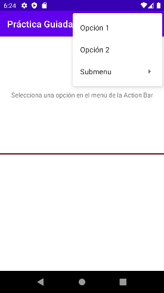
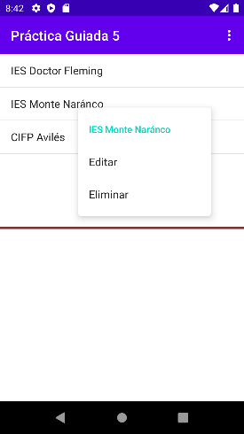

# PRÁCTICA GUIADA 5
## MENÚS EN ANDROID
### Programación Multimedia y Dispositivos Móviles - Curso 2022-23

***

Los menús son un componente común de la interfaz de usuario en muchas aplicaciones. Entre ellos están los menús principales en la barra de la aplicación (ActionBar), los menús contextuales o los menús emergentes. En esta práctica se han creado algunos ejemplos.

#### Menú en la barra de acción

La barra de acción (action bar) es una barra que aparece en la parte superior de una aplicación Android. Muestra el nombre de la aplicación y puede contener botones de acción y un menú de opciones que se despliega pulsando el icono situado al lado de su borde derecho, como muestra la imagen siguiente:

#### Menú contextual
Un menú contextual es aquel que se despliega al pulsar durante un tiempo
sobre un componente concreto, y va asociado a él. La imagen siguiente 
muestra el menú contextual que se despliega al tocar un elemento de un
ListView:

